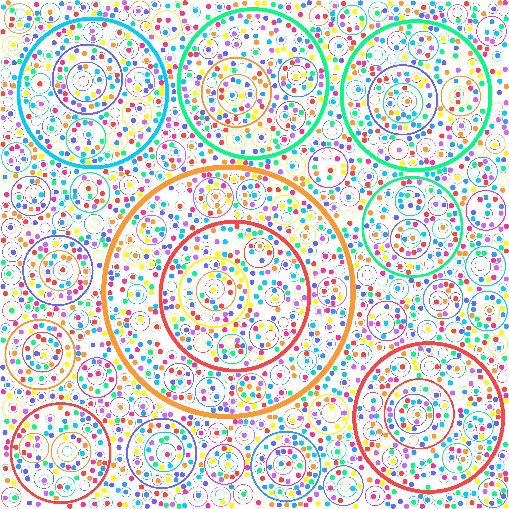

# Circle Packing with NumPy and Pillow

This project implements a **randomized circle packing algorithm** in Python, using NumPy for fast array operations and Pillow for image output. The algorithm places non-overlapping circles of various radii and colors onto a canvas, creating vibrant generative art.

## Features

- **Multiple circle sizes:** Supports a customizable set of radii and thicknesses.
- **Colorful output:** Circles are drawn with a palette of vivid RGBA colors.
- **Non-overlapping:** Each circle is placed only if it fits entirely within the canvas and does not overlap existing circles.
- **Efficient stamping:** Circles are pre-rendered as "stamps" and pasted onto the canvas for speed.
- **Configurable canvas size:** Default is 2000x2000 pixels, but you can change it.

## How It Works

1. **Stamp Generation:**  
   For each combination of radius, thickness, and color, a small NumPy array ("stamp") is created representing the circle.

2. **Random Placement:**  
   For each circle size, the algorithm attempts to place a specified number of circles at random positions.  
   - It checks that the circle fits within the canvas.
   - It checks that the region is empty (no overlap).
   - If both checks pass, the stamp is pasted onto the canvas.

3. **Output:**  
   The final packed canvas is saved as a PNG image.

## Example Output



## Usage

1. **Install dependencies:**
   ```bash
   pip install numpy pillow
   ```

2. **Run the script:**
   ```bash
   python circle_packing.py
   ```

3. **Result:**  
   The output image (e.g., `packed_circles3.png`) will be saved in your working directory.

## Customization

- **Change radii, thickness, or colors:**  
  Edit the `radii_set`, `thickness_set`, or `color_set` arrays in `circle_packing.py`.
- **Adjust canvas size:**  
  Change the `Canvas(width, height)` instantiation.
- **Tune packing density:**  
  Modify `counter_limits` and `max_attempts_per_circle` for more or fewer circles.

## File Structure

```
circle_packing.py   # Main algorithm and script
circle.py           # Circle stamp generation
canvas.py           # Canvas class for image handling
README.md           # This file
```

---

**Enjoy creating generative art with circle packing!**
