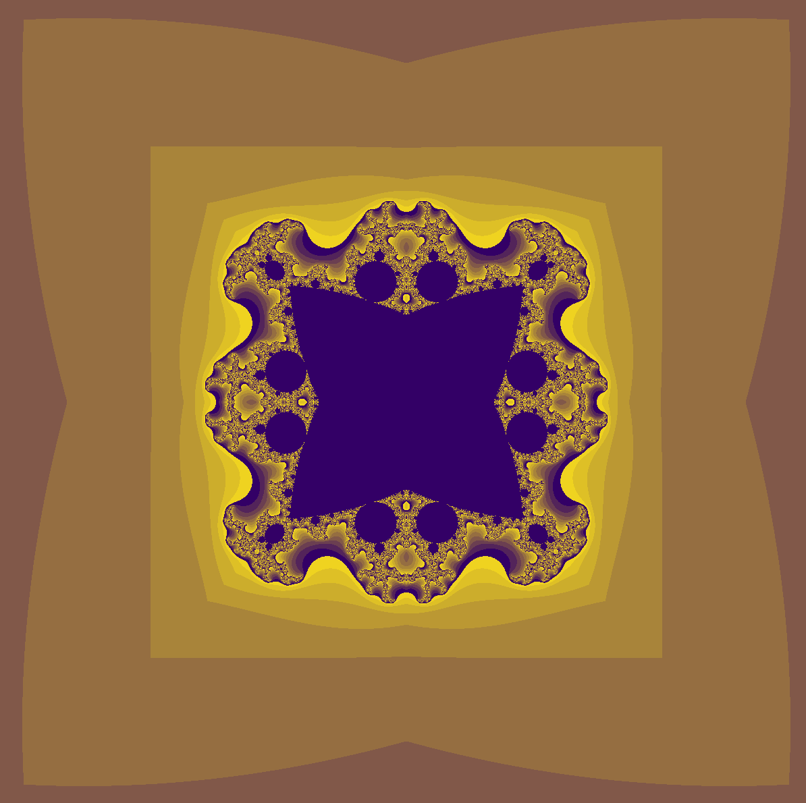

# Mandelbrot Kaleidoscope

This project visualizes the Mandelbrot set with kaleidoscopic symmetry using ModernGL and Python. It renders the fractal in real-time, allowing for zooming and color exploration.

## Features

- Real-time Mandelbrot set rendering
- Kaleidoscopic symmetry effect
- Customizable zoom and center
- GPU-accelerated with ModernGL

## Setup

1. **Install dependencies:**
   - Python 3.8+
   - [moderngl](https://moderngl.readthedocs.io/)
   - [moderngl-window](https://github.com/moderngl/moderngl-window)
   - numpy
   - cupy (for particle.py)

2. **Set shader paths:**
   - In `mandelbrot.py`, update the `vertex_shader` and `fragment_shader` paths to point to your local shader files.
   - Example:
     ```python
     vertex_shader='path/to/particle.vert',
     fragment_shader='path/to/particle.frag'
     ```

3. **Run the project:**
   ```bash
   python mandelbrot.py
   ```

## Example Output




## Notes

- Make sure your shader file paths are correct, or the program will not run.
- The default window size is 1280x1280 (square aspect ratio).
- You can adjust the Mandelbrot center and zoom in `mandelbrot.py`.

---

Enjoy exploring the Mandelbrot set!
