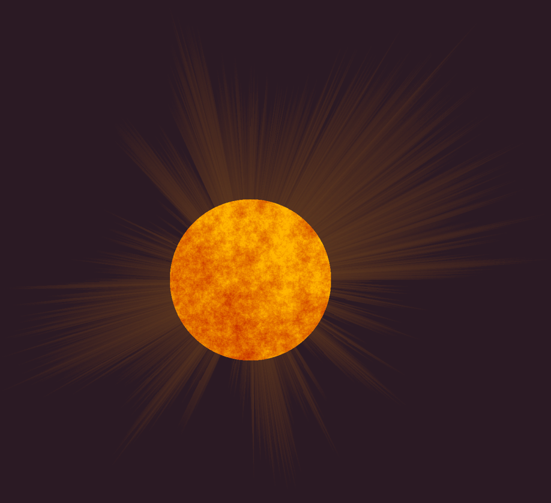

# Radial Outburst

Radial Outburst is a Python project that generates a visually striking "radial outburst" effect using Perlin noise and custom rendering logic. The effect is rendered onto a canvas and saved as an image. The project is designed for creative coding and generative art enthusiasts.

## Features

- **Radial Starburst**: A central star is rendered with color variation based on 2D Perlin noise.
- **Dynamic Rays**: Hundreds or thousands of rays burst outward from the center, with lengths and thickness modulated by 1D Perlin noise.
- **Customizable Parameters**: Easily adjust the number of rays, star radius, noise parameters, and color schemes.
- **Efficient Canvas Rendering**: Uses NumPy for fast pixel manipulation and image generation.

## Project Structure

- [`outburst.py`](P08%20-%20Radial%20Outburst/outburst.py): Main script for generating the radial outburst effect.
- [`perlin.py`](P08%20-%20Radial%20Outburst/perlin.py): Contains Perlin noise implementations (1D, 2D, 3D).
- [`canvas.py`](P07%20-%20Basic%20Shapes/canvas.py): Simple canvas abstraction for pixel-based drawing.
- `output/image.png`: Example output image generated by the script.

## Example Output

Below is an example of the radial outburst effect generated by this project:



## Requirements

- Python 3.7+
- NumPy
- Pillow (PIL)
- (Optional) CuPy for GPU acceleration (if you want to experiment with larger images or faster computation)

Install dependencies with:

```sh
pip install numpy pillow
```

## Usage

1. Clone this repository or copy the project files.
2. Run the main script:

```sh
python P08\ -\ Radial\ Outburst/outburst.py
```

3. The generated image will be saved as `output/radial_outburst.png`.

## Customization

You can tweak parameters such as the number of rays, star radius, Perlin noise settings, and color mapping directly in [`outburst.py`](P08%20-%20Radial%20Outburst/outburst.py) to create different visual effects.

## License

This project is for educational and creative use. Feel free to modify and share!

---

*Created with love for generative art and creative coding.*
